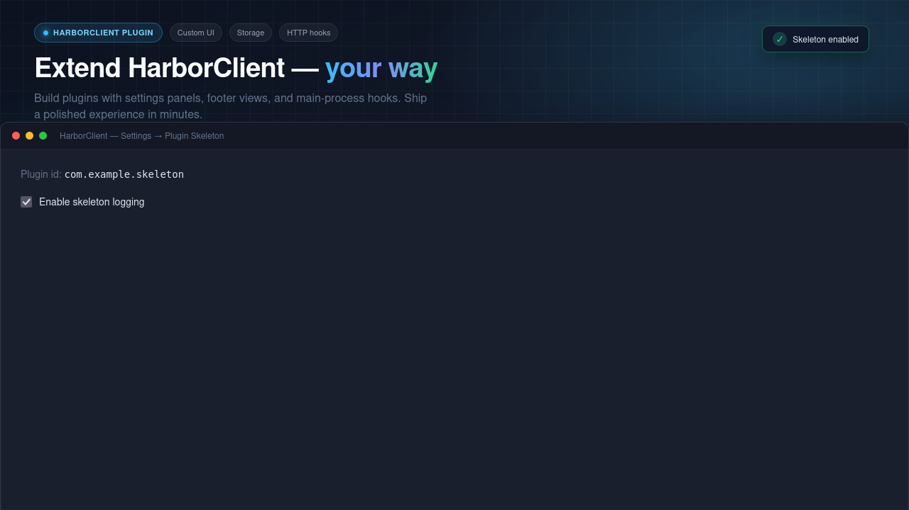

# HarborClient Plugin Skeleton

Starter template for HarborClient plugins with renderer UI (JSX) and a main-process HTTP hook.




## Features

- Official JSX runtime via `@harborclient/sdk` (`installReact`, hook barrel)
- Settings section with persistent storage
- Footer panel following the host layout contract
- Main entry logging `onAfterSend` exchanges

## Setup

```bash
pnpm install
pnpm build
```

Load the project folder in HarborClient via **Settings → Plugins → Load unpacked…**.

Requires `@harborclient/sdk@^0.4.0` from npm.

## Sign and verify

After building entry files, sign the plugin directory (this repository root) with an Ed25519 key:

```bash
pnpm plugin:sign -- --dir . --private-key /path/to/signing.pem --key-id my-publisher
pnpm plugin:verify -- --dir . --public-key /path/to/public.key
```

See the [@harborclient/sdk signing docs](https://harborclient.github.io/sdk/signing) for key generation and `signature.json` format.

## Local SDK development

Do not commit `file:` paths in `package.json`. To test against a local `@harborclient/sdk` checkout without changing tracked files, use one of:

- `pnpm link` from the published package directory after `pnpm pack` in `packages/sdk`
- A gitignored override file (for example `.pnpmfile.cjs` or a local-only `pnpm-workspace.yaml` entry) that only exists on your machine

## Development

```bash
pnpm dev
```

Rebuilds `dist/renderer.js` and `dist/main.js` on change. Keep a contributed UI surface open for hot reload.

## Customize

1. Change `id`, `name`, and `contributes` in `manifest.json`.
2. Replace example components under `src/components/`.
3. Adjust permissions to match your plugin's needs.

## Marketing screenshot

Generate a 1280×720 PNG for plugin listings or README hero images. The output is written to `screenshot.png` at the repository root.

### Prerequisites

Install [Firefox](https://www.mozilla.org/firefox/). The render script uses headless Firefox because it captures the full 1280×720 frame reliably; Chrome headless clips the bottom of this layout.

### Customize the template

Edit [`scripts/screenshot-marketing.html`](scripts/screenshot-marketing.html) before rendering:

| Region         | Selector                 | Purpose                                                                |
| -------------- | ------------------------ | ---------------------------------------------------------------------- |
| Category badge | `.plugin-badge`          | Label above the headline (default: "HarborClient Plugin")              |
| Feature pills  | `.badge-row .pill`       | Highlight bullets; add or remove `<span class="pill">` elements        |
| Headline       | `h1` / `h1 span`         | Main title; the gradient accent is on the `<span>`                     |
| Description    | `.subtitle`              | One-line value proposition                                             |
| Window title   | `.toolbar-title`         | Mock HarborClient window chrome                                        |
| UI preview     | `.plugin-panel`          | Main mockup body (default: settings panel with plugin id and checkbox) |
| Success toast  | `.toast` / `.toast-text` | Optional banner; delete the entire `.toast` block to hide it           |

The default mockup mirrors this skeleton's settings panel. If your plugin contributes request tabs or a footer panel instead, replace the `.plugin-panel` HTML with markup that matches your UI.

Preview the layout by opening the HTML file in a browser at 1280×720 before rendering.

### Generate

```bash
pnpm screenshot
```

Or run the script directly:

```bash
./scripts/render-screenshot.sh
```

On success you should see: `Wrote screenshot.png (1280x720)`.
